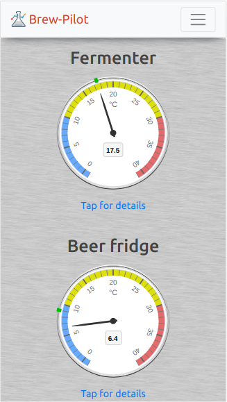

# brew-pilot

RaspberryPi and Arduino temperature controller for fermentation chambers and beer fridges.

The Arduino is responsible for the actual temperature control while the RPi provides a web-based management interface and passes control parameters to the Arduino.

The frontend currently assumes one fermenter and one beer fridge, though most of the internals are flexible in this regard, allowing any number of _chambers_ to be configured. Each chamber may have any number of associated _gyles_ (all but the latest being historical). For a given chamber, the latest gyle is considered _active_ if it has a start time earlier than now AND either no end time or an end time later than now.

Each chamber is assumed to have refrigeration but a heater is optional. A chamber without a heater is assumed to be a _beer fridge_.

## Key components

- Frontend is a React SPA.
- Backend is a Java Spring Boot app.
- The Arduino microcontroller code is C++.

In addition the RPi should be equipped with a Linux OS, a Java VM and a webserver such as nginx (sample nginx config files provided).

Note there is no database server. Rather, the last few minutes worth of readings are held in memory by the Java app before being dumped to disk (as a series of JSON files). When the frontend requests data for plotting charts, the Java app simply returns the names of the relevant JSON files (alongside any _latest readings_ from memory); the frontend then requests the data files (directly from the web server, without the Java app being further involved). The JSON files are aggregated once in a while so the frontend never has to request too many.

The only RPi model to have been proven is the "Pi 4 Model B", though "Pi 3 Model B" should be sufficient. It will need ethernet or WiFi networking. Best to equip the RPi with a heat sink and ensure the enclosing project box is well ventilated, but other than this a fan should not be necessary since the RPi isn't worked hard.

The Arduino model is Uno.

## Rationale for Arduino microcontroller

The reason for using a microcontroller in addition to the RPi is robustness; the Arduino (hardware and application code) is relatively simple and therefore less likely to fail. If the RPi goes down for any reason the Arduino will continue controlling the chambers according to the last set of parameters received from the RPi. The Arduino caches the last set of parameters received in EEPROM; so, if for some reason only the Arduino were to come back up after a power cut, it would still be able to maintain the last setpoint temperature for each chamber.

It's also convenient that the Arduino, having 5v IO pins, can drive commonly available relays directly.

## Misc hardware

Project box large enough to house the RPi, Arduino, relays and output mains power sockets.

### Relay recommendations

- SSDs for heaters, since these are cycled frequently.
- Mechanical for fridges, since the inductive load can be a challenge for SSDs.

The Arduino code assumes the relays are all _low level trigger_. (It would be a straightforward code change if this were not the case.)

### Temperature sensors

These should be DS18B20 (the waterproof variety where the business end is housed in a short stainless steel tube). Despite the fact that this sensor's interface is described as 'one-wire' (that is, one shared signal wire in addition to a common ground wire), significantly better reliability is achieved by using the three wire option combined with a 4.7kΩ pull-up resistor.

#### Sensors used

- All the chambers are assumed to be co-located, so a common probe is used to measure the external temperature (e.g. ambient temperature in your garage).
- Each chamber uses two probes - one for the ambient temperature insider the chamber and a second for the beer. For a beer fridge this is perhaps overkill (and is something that should be made configurable); I wrap one beer bottle in a wine cooler sleeve and push the _beer_ probe between bottle and sleeve. The _chamber_ probe should just be dangled somewhere away from the beer (and obviously away from the heater and the internal sides of the fridge). For a fermenter without a thermowell it's sufficient to just strap the probe to the side of the vessel, under a wodge of insulation such as bubble wrap.
- Finally, a probe is dedicated to measuring the temperature inside the project box (housing all the hardware).

So, six sensors for a two chamber installation.

#### Sensor calibration

Strap them all together then, with the Arduino connected to your development PC, call the `calibrateTemperatureSensors()` function (defined in `Temperature.h`) from the main `loop()` (defined in `ChamberCOntroller.ino`). This will regularly print (to the Arduino's serial console) the reading and the address of each sensor. Check for any outliers then assume the correct temperature is the average of the non-outliers. Or use a lab calibrated thermometer. Once you have established the 'true' temperature, determine an error offset for each sensor and program these, along with the device addresses, in `initTemperatureSensors()` (see calls to `initSensorData()`).

## Screenshots

Home page (on mobile) 

Profile editor 

Chart 
 Note: Heater at 100% maps to 10°C on the y-axis (50% -> 5°C, etc.)

## Demo

A live BrewPilot installation may be visible here: https://brewpilot.ml/ (username: `guest`; password: `BeerIsGood!`)

## Contact

Mail to: 
