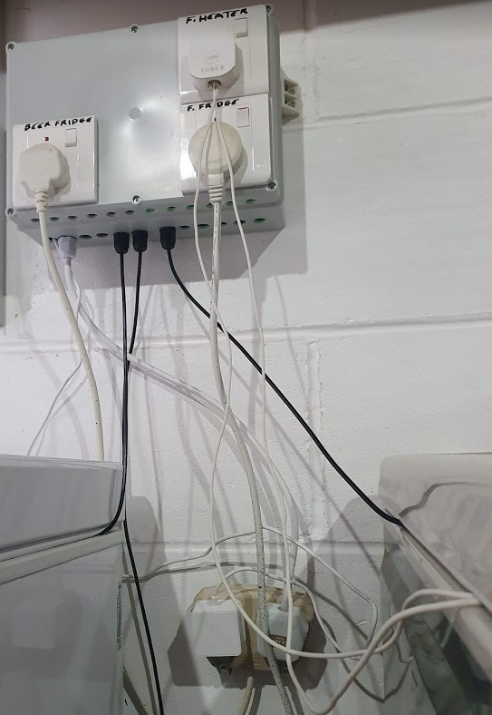

# brew-pilot

RaspberryPi and Arduino temperature controller for fermentation chambers and beer fridges.

The Arduino is responsible for real time temperature control while the RPi provides a web-based management interface.

The chamber heater is controlled in PID fashion. The heater power is pulsed to achieve a pseudo variable power level.
<br>The fridge, on the other hand, is controlled conservatively to avoid short cycling the compressor.

Each chamber is assumed to have refrigeration but a heater is optional. A chamber without a heater is assumed to be a _beer fridge_.

Each _chamber_ may have any number of associated _gyles_ (all but the latest being historical). For a given chamber, the latest gyle is considered _active_ if it has a start time earlier than now AND either no end time or an end time later than now. A beer fridge typically has only one gyle, with a flat temperature profile, and always active (no end time).

The management interface supports:

- Guest and Admin login
- Creation and update of a _fermentation profile_, specifying the desired temperature of the beer over time.
- Activating a gyle, either automatically at a specified time or manually (e.g. when signs of fermentation are first seen);
  <br>deactivating a gyle, either automatically at a specified time or manually (when the beer is removed from the chamber).
- Charting the progress of a gyle over time (in terms of target vs. actual temperature, heater & fridge activity, etc.)
- System status report (health, uptime, free resources, etc.)

The frontend code currently assumes one fermenter and one beer fridge, and the Arduino code currently assumes no more than two chambers. Throughout the stack, though, the software lends itself to straightforward adaptation to support other setups.

## Key components

- Frontend is a React web app written in TypeScript.
- Backend for the management interface is a Java Spring Boot application.
- The Arduino microcontroller code is C++.

In addition the RPi uses a Linux OS, a Java VM and a webserver such as nginx (sample nginx config files are provided).

[//]: # "Note there is no database server. Rather, the last few minutes worth of readings are held in memory by the Java app before being dumped to disk (as a series of JSON files). When the frontend requests data for plotting charts, the Java app simply returns the names of the relevant JSON files (alongside any _latest readings_ from memory); the frontend then requests the data files (directly from the web server, without the Java app being further involved). The JSON files are aggregated once in a while so the frontend never has to request too many."

The only RPi model to have been proven is the "Pi 4 Model B" (the 4GB RAM version though 2GB would be ample). "Pi 3 Model B" should be fine, though 1GB RAM might be a bit tight.
<br>
<br>The RPi will need ethernet or WiFi networking, of course. Best to equip the CPU with a heat sink and ensure the project box is well ventilated, but a fan shouldn't be necessary since the processor isn't driven hard.

The Arduino model is Uno.

## Rationale for Arduino microcontroller

The reason for using a microcontroller in addition to the RPi is robustness; the Arduino (hardware and application code) is relatively simple and therefore less likely to fail. If the RPi goes down for any reason the Arduino will continue controlling the chambers according to the last set of parameters received from the RPi. The Arduino caches the last set of parameters received in EEPROM; so, if for some reason only the Arduino were to come back up after a power cut, it would still be able to maintain the last setpoint temperature for each chamber.

It's also convenient that the Arduino, having 5v IO pins, can drive commonly available relays directly.

Note: The Arduino connects to the RPi with a USB cable, providing power and a communication channel. (An Arduino board usually comes with a suitably short USB cable.) A separate power supply for the Arduino is not necessary.

## Misc hardware

A project box large enough to house the RPi, Arduino, relays and output mains power sockets.

Output mains power sockets. Tip: worth spending a bit extra for sockets with neon indicators.
Note, however, that when a socket is switched using an SSR, it seems the SSR may not fully trigger unless a load is connected (meaning the neon won't light).

Cable glands to secure cables entering/exiting the project box.

Jumper wires for connecting the Arduino pins to the temperature sensors and the relays.

If you want to branch heat sensor cables (so that only one cable leaves the project box per chamber before branching into two cables within the chamber) then you'll probably want to use some heat-shrink to make a tidy job of the joint (see picture below).

### Relays

- **For heaters**: Solid State Relays (SSRs) are recommended because these are pulsed to give a pseudo variable heater output between 0-100%.
  (Pulse cycle time is 100 seconds; 1% output equates to 1s on, 99s off; 2% output equates to 2s on, 98s off; etc.)
  Relatively cheap SSRs can be used because the power being switched is low and non-inductive. 240V x 0.5A is good for 100W, which is more than enough for a small chamber (a 20W heater is adequate).
  **NOTE**: Because the heater is pulsed, using a light bulb as the heat source is not recommended.
- **For fridges**: Mechanical relays are recommended because the inductive load is a challenge for all but the most expensive SSRs. Mechanical relays are absolutely fine for cycle times in the order of minutes. SSRs are really superfluous here.
  <br>Minimum rating for mechanical relay: 240V, 10A.
  <br>Minimum rating if you insist on SSR: 240V, 25A (ideally 40A, for more confidence). It'll need to be random triggered type (not zero-cross type). An RC snubber or MOV will be necessary.

The Arduino code assumes the relays are all _low level trigger_. (It would be a straightforward code change to use _high level trigger_ instead.)

### Temperature sensors

These should be DS18B20 (the waterproof variety where the business end is housed in a short stainless steel tube). Despite the fact that this sensor's interface is described as 'one-wire' (that is, one shared signal wire in addition to a common ground wire), using all three wires with a 4.7kΩ pull-up resistor gives much better reliability.

#### Sensors used

- All the chambers are assumed to be co-located, so a common probe is used to measure the external temperature (e.g. ambient temperature in your garage).
- Each chamber uses two probes - one for the ambient temperature insider the chamber and a second for the beer. For a beer fridge this is perhaps overkill (and is something that could be made configurable); I wrap one beer bottle in a wine cooler sleeve and push the _beer_ probe between bottle and sleeve. The _chamber_ probe should just be dangled somewhere away from the beer (and obviously away from the heater and the internal sides of the fridge). For a fermenter without a thermowell it's sufficient to just strap the probe to the side of the vessel, under a wodge of insulation such as bubble wrap.
- Finally, a probe is dedicated to measuring the temperature inside the project box (housing all the hardware).

So, six sensors in total for a two chamber installation.

#### Sensor calibration

Strap all the sensor heads together with a rubber band and wait at least 10 minutes (or maybe speed up temperature equalisation my immersing the heads in a cup of water). With the Arduino connected to the development PC, call the `calibrateTemperatureSensors()` function (defined in `Temperature.h`) from the main `loop()` (defined in `ChamberController.ino`). This will regularly print (to the Arduino's serial console) the reading and the address of each sensor. Check for any outliers then assume the correct temperature is the average of the non-outliers. Or use a lab calibrated thermometer. Once you have established the 'true' temperature, determine the error offset for each sensor and program these, along with the device addresses, in `initTemperatureSensors()`:

```C++
  // Edit this in sympathy with SENSOR_COUNT, having established each device's address and
  // error using calibrateTemperatureSensors()
  initSensorData(CH1_T_BEER,    0x3A11, 19);
  initSensorData(CH1_T_CHAMBER, 0x3606, 7);
  initSensorData(CH2_T_BEER,    0x3EE1, 11);
  initSensorData(CH2_T_CHAMBER, 0x79BA, -6);
  initSensorData(T_EXTERNAL,    0xBD96, -9);
  initSensorData(T_PI,          0x3B79, -13);
```

Parameter 2 is the sensor address and parameter 3 is the error offset \* 100. After being divided by 100 the error offset value will be ADDED to the reading from the device.

## Arduino I/O pins

These are configured in `ChamberController.ino`, e.g.:

```C++
  // Input
  #define PIN__ONE_WIRE_BUS 2  // Temperature sensor bus
  // Output
  #define PIN__CH1_FRIDGE   7  // Mechanical relay, ch1
  #define PIN__CH2_FRIDGE   8  // Mechanical relay, ch2
  #define PIN__CH1_HEATER   12 // SSR, ch1
```

In addition, jumper wires will be needed for the 5V and GND pins.

## Danger of death

Seriously, unless you really know what you're doing it's a good idea to get an electrician to give your wiring a once over before connecting to the mains power supply for the first time.

## Screenshots and photos

**Home page (on mobile)**:<br>

**Chart**:
<br>
<br>Note regarding the heater series (pink line): When the heater is outputting 100% this maps (arbitrarily) to 10°C on the y-axis (10% -> 1°C, etc.). (Didn't want to clutter the screen with two y-axes.) Likewise for the fridge series (though not shown here): 'fridge on' maps to 10°C on the y-axis; 'fridge off' maps to 0°C. (Unlike the heater, the fridge is either on or off, of course.)
<br>Tip: 20 watts of heating is plenty for a small chamber. I use a short length of water pipe frost protection cable draped around the bottom of the chamber; takes up next to no space.

**Fermentation temperature profile editor**:
<br>

**Example project box**:
<br>
<br>The three black cables leaving the bottom of the box are temperature sensor cables. The one in the middle just dangles, measuring the garage temperature. The other two black cables (left and right) go into each chamber, where each branches into two sensors. (Note: electrically, all the sensors are actually connected in parallel.) So five external sensors here in total. There is a sixth sensor inside the project box.
<br>The two white cables entering the box bottom left are the 5v power for the electronics (all via the RPi's USB port) and the input mains power (which will be connected to the output sockets via the relays).

**Branched sensor cable**:
<br>

## Demo

An actual BrewPilot installation may be live here: https://brewpilot.ml/ (username: `guest`; password: `BeerIsGood!`)

## Contact

Mail to: 
